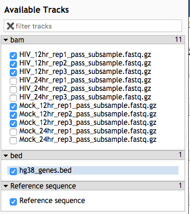
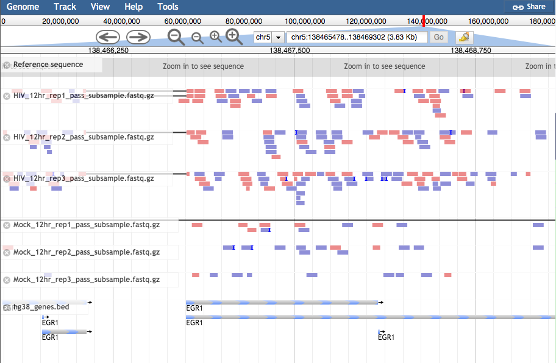

## Import a gene annotation file from a Data Library to be used for feature counting
- Click **Shared Data** on the top menu bar and select **Data Libraries**
- Select **annotation_files**
- Select the box next to **hg38_genes.gtf** and **hg38_genes.bed**.
- Click **Export to History** next to the Search bar and choose **as Datasets**
- Click **Import** to add the file to our current history 
- Click<D-d> **Tufts Galaxy** in the top left to return to the homepage

## View bam file using JBrowse
- In the **Tools** panel search bar, type **JBrowse** and select **JBrowse** genome browser
- Under **Select a reference genome** select **hg38**
- Under **Track Group** click **Insert Track Group**
- Under **Track Category** type “bam files”
- Click **Insert Annotation Track**
- Select track type **BAM Pileups** and under **BAM Track Data** click the folder icon and select the list **RNA STAR on collection: mapped.bam**
- Again, click **Insert Track Group**
- Under **Track Category** type “genes”
- Click **Insert Annotation Track**
- Select track type **GFF/GFF3/BED Features** and under **GFF/GFF3/BED Track Data** select **hg38_genes.bed**.
- Scroll down and click **Execute**.
- Once the job is complete (green) click the eye icon to view the data. It will first say “Loading” and then an error box will appear “Error reading from name store”. Click **OK** as this is a known galaxy [bug](https://github.com/galaxyproject/tools-iuc/issues/1277)
- In the **Available Tracks** panel select the HIV and Mock samples from 12 hr, as well as the bed file.

- We'll zoom in on one gene **EGR1**. To do this, click on the search bar to the left of the **Go** button and type **chr5: 138465479..138469303** The bam tracks will show the reads that align to the region for each sample. The color will show whether the read aligns to the + or –strand and grey lines show splice regions where a read spans an intron. The gene track at the bottom called **hg38_genes.bed** will show 6 features of EGR1, by clicking on them you will be able to see the different feature types (exon, CDS, start_codon, stop_codon).

<b>Question 7: Which samples appear to show higher expression of EGR1, the Mock or HIV?</b>

 
Answer: HIV

<b> Question 8: How many exons does this gene have?</b>

 
Answer: two

## Count the reads for each gene using featureCounts
- In the **Tools** panel search bar, type **featureCounts**
- Select **featureCounts** under **RNA-seq**
- Under **Alignment file** click the  and select the bam collection generated by **STAR**
- Under **Gene annotation file** select **in your history**
- Select **hg38_genes.gtf**
- Under **Create gene-length file** select **Yes**
- Click **Execute**
- The result will be three collections: feature lengths, summary, and Counts
- View the Counts file for a sample by clicking the collection and clicking the 
- Run **MultiQC** on the **Summary** collection (similar to previous steps, except selecting the appropriate tool (featureCounts) and input folder (featureCounts Summary)).

<b> Question 9: The main output of the featureCounts MultiQC plots is the second plot, which shows whether reads were assigned to genes (features) or not. What is the main reason for reads not being assigned to features?</b>

 
Answer: multimapping reads

[Next: Differential Expression](05_Diff_expression.md)

[Previous: Read Alignment](03_Read_alignment.md)
