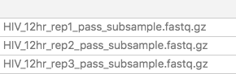
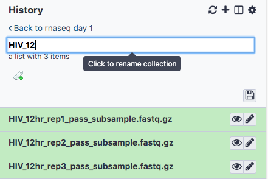
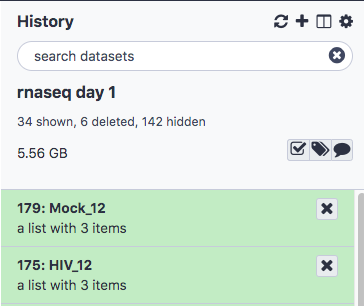
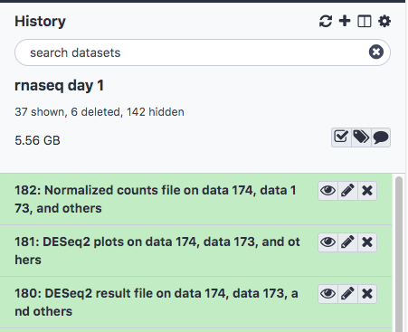

## Run DESeq2 to test for differential expression between Mock and HIV at 12 hr

### In preparation to run DESeq2, create separate collections for the counts files for Mock 12 hr and HIV 12 hr.
- In the **Tools** panel search bar, type **Apply Rule to Collection**
- Choose **125:featureCounts on collection 85: Counts**
- Click **Edit**
- Click Filter, then **Using a Regular Expression**
- Under **Regular Expression?**, type HIV_12 (Do not put any extra spaces following the expression). This is a regular expression which will match any file that contains the string **HIV_12**
- Click Apply and the list of files in column A should show three samples:

- Click **Rules**, and then **Add/Modify Column Definitions** 
- Click **Add** Definition, then **List Identifier(s)**, select **A**, click Apply
- Click **Save**
- Click **Execute**
- Rename the collection by clicking to expand the collection, then clicking on the title, typing **HIV_12** , and pressing enter.

- Do the same for Mock 12 hour samples, and modify the regular expression appropriately.
- The two collections should appear in the history (you may have to refresh history in order to see the names)

### Test for Differential Expression using DESeq2using the datasets we created in step 14.
- In the **Tools** panel search bar, type **DESeq2** and select **DESeq2** under **RNA-seq**
- Under **1: Factor** , specify the factor name **Condition**
- Under **1: FactorLevel**, specify the base factor level **Mock**
- Under **Counts file(s)** select the folder icon and select the **Mock_12** collection
- Set the **2: FactorLevel** to **HIV**
- Under **Counts file(s)** select the folder icon and select the **HIV_12** collection
- Set **Output normalized counts table** to **Yes**
- Scroll down and click **Execute**
- **DESeq2** will produce three output files: A normalized counts table, a plots file, and a results file.

### View and interpret DESeq2 output files
- Results file: View the results table by clicking on the history item **DESeq2 result file on data ... and others** and clicking on the eye icon.

<b> Question 10: What are the top two most significant genes </b>

 
Answer: MYC, EGR1

- Plots: View the plots by clicking on the history item **DESeq2 plots on data ... and others** and clicking the eye icon.

<b> Question 11: What observations can you make from the PCA plot?</b>

 
Answer: Mock samples cluster together more tightly than the HIV. HIV_12hr_rep2 is more distant from the other HIV samples.

<b> Question 12: What observation can you make about the pvalue distribution, does it look like there are many true significant results?</b>

 
Answer: It looks more or less uniform, signaling that we do not have many true positive results. This is expected, however, since the reads have been downsampled. The p-value distribution for the full dataset is shown in lecture.

[Previous: Gene quantification](05_Gene_quantification.md)
